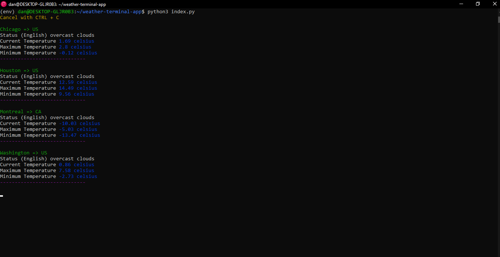

# Weather Terminal App.

__See the weather from the terminal.__

__This is a small weather app from the terminal, made with python3.__


## Installation.

* Clone the repository.
```bash
git clone https://github.com/EduardYan/weather-terminal-app.git
cd weather-terminal-app

```

* Install the dependencies from requirements file.
```bash
pip3 install -r requirements.txt
```

## Run.

__For run execute:__

```bash
python3 index.py
```

__But, you should have an openweathermap account in order to receive the data. This website needs a key to be able to access the data. So you can create an account here. After creating it, you can access your access keys here. Register with your account and you will see an access key. You can use that default key or create a new one.__

__Then copy that key and create an environment variable with the name APPID and the value of your key. ___

## Creating in Windows.

```cmd
setx APPID your_key
```

__After of APPID, set your key__

More information (recommended) [https://medium.com/@01luisrene/como-agregar-variables-de-entorno-s-o-windows-10-e7f38851f11f](https://medium.com/@01luisrene/como-agregar-variables-de-entorno-s-o-windows-10-e7f38851f11f)

## Creating in Linux or Mac.

__Edit the file ~/.bashrc:__

```bash
nano ~/.bashrc
```

__Write to end of file: __

```txt
export APPID = your_key
```

__And source:__

```bash
source ~/.bashrc
```

# Screenshot.


## Error or problems:

<a href="mailto:eduarygp@gmail.com">eduarygp@gmail.com</a>
